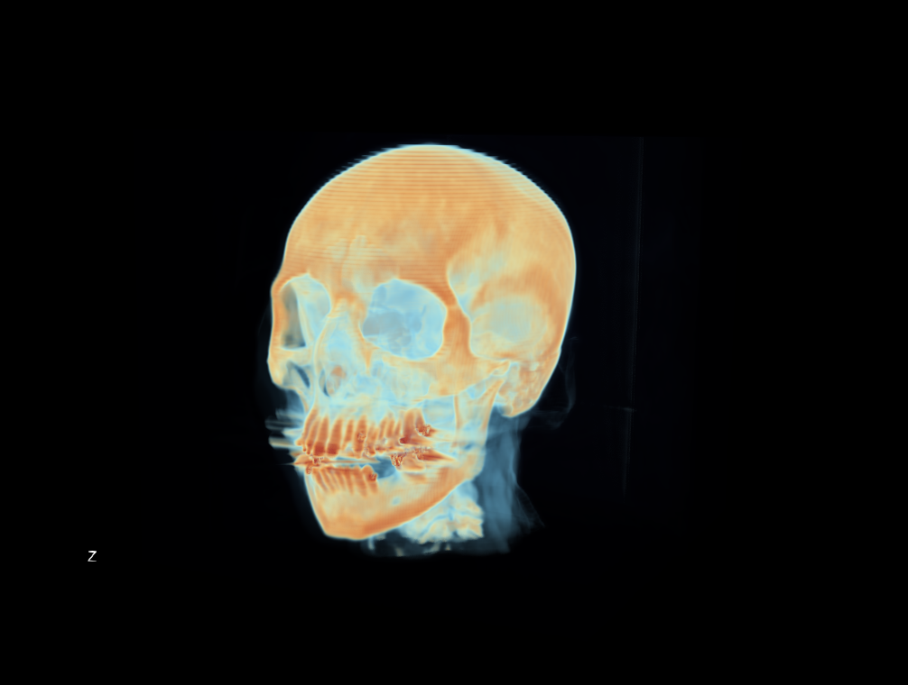
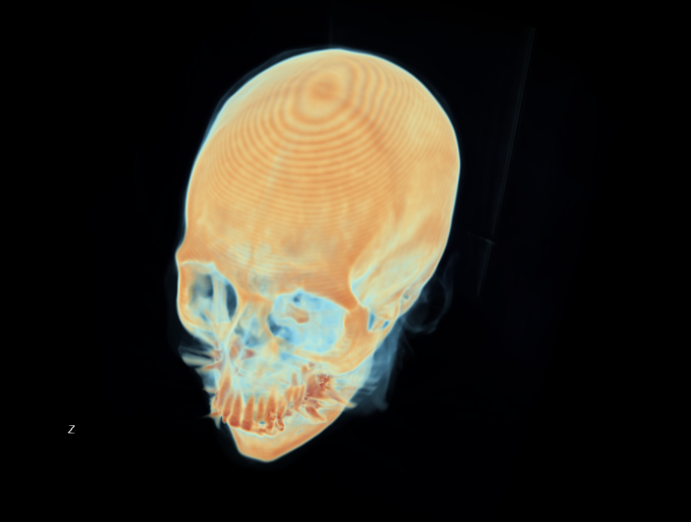

# ParaView Scientific Visualization Portfolio

Demonstrations of scientific visualization techniques in [ParaView](https://www.paraview.org/), with a focus on airborne lidar point cloud analysis and medical imaging.

## Projects

### [Indiana Statewide Lidar - Land Cover Classification](indiana-lidar/)

Categorical land cover visualization of an airborne lidar point cloud. Identified and corrected a flight strip classification inconsistency in the source data.

| Raw Classification | Corrected Classification |
|---|---|
|  |  |

### [CT Head - Volume Rendering](ct-head/)

Volume rendering of a CT head scan demonstrating transfer function manipulation, opacity curve tuning, and medical imaging visualization.

| Frontal View | Oblique View |
|---|---|
|  |  |

## Tools

- ParaView 6.1.0-RC1 on Fedora 43 (Linux)

## About

I hold an M.S. in Imaging Science from RIT and a B.S. in Electrical Engineering from Michigan State University. My background includes deep learning, computer vision, and 3D lidar point cloud classification. I have professional experience with ParaView in an industry setting; these samples were created independently using publicly available datasets.
