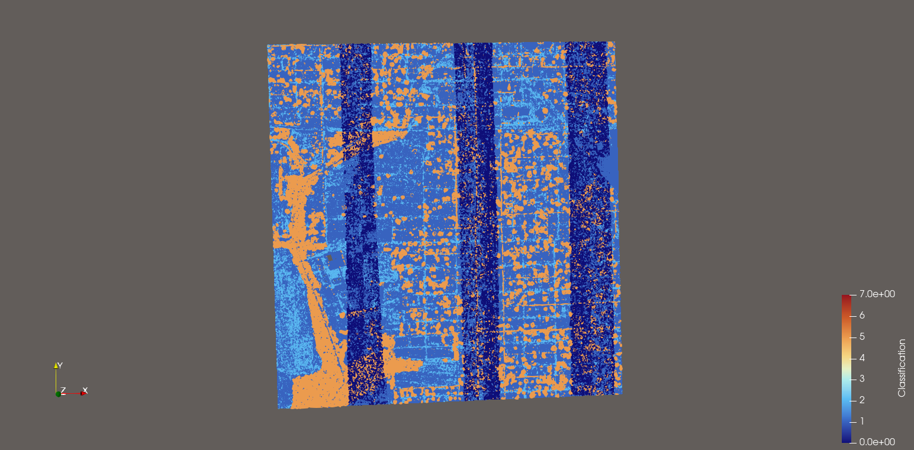
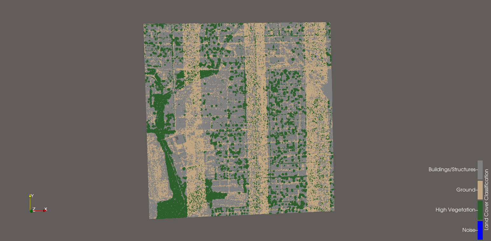

# ParaView Scientific Visualization Portfolio

Demonstrations of scientific visualization techniques in [ParaView](https://www.paraview.org/), with a focus on airborne lidar point cloud analysis and geospatial data processing.

## Indiana Statewide Lidar — Land Cover Classification

**Dataset:** [IndianaMap Framework Lidar (2011)](https://doi.org/10.5069/G9959FHZ), distributed by OpenTopography via the Indiana Statewide Imagery and LiDAR Program.

**Overview:** Categorical land cover visualization of an airborne lidar point cloud covering a suburban area in Indiana. The dataset contains approximately four land cover classes derived from ASPRS LAS classification codes: ground, buildings/structures, high vegetation, and low-point noise.

### Data Quality Issue — Flight Strip Classification Inconsistency

During initial inspection, a systematic classification artifact was visible as alternating diagonal bands across the dataset, corresponding to individual flight line swaths. Investigation revealed that ground points were labeled inconsistently between processing batches: some strips used ASPRS class 0 (Never Classified) for ground, while others used class 2 (Ground). Vegetation (class 5) was labeled consistently across all strips, confirming that classification had been performed on every strip — the inconsistency was limited to the ground label convention.

A Calculator filter was applied to unify ground labeling (`if(Classification == 0, 2, Classification)`), eliminating the strip artifact from the classification view.

A secondary, subtler strip pattern remains visible in the corrected data due to point density variation between single-coverage and overlapping flight line regions. This is an acquisition geometry artifact inherent to the data, distinct from the classification inconsistency.

| View | Description |
|------|-------------|
|  | Raw classification showing flight strip labeling inconsistency |
|  | Corrected classification with unified ground labels and categorical coloring |

### Techniques Used

- Categorical color mapping with ASPRS-standard class labels
- Point attribute inspection and data quality assessment
- Calculator filter for conditional reclassification
- High-resolution screenshot export with annotated legends

## Tools

- ParaView 6.1.0-RC1 on Fedora 43 (Linux)

## About

I hold an M.S. in Imaging Science from RIT and a B.S. in Electrical Engineering from Michigan State University. My background includes deep learning, computer vision, and 3D lidar point cloud classification. I have professional experience with ParaView in an industry setting; these samples were created independently using publicly available datasets.

## License

Visualizations and documentation in this repository are my own work. Dataset citations and terms of use are noted per-project above.
